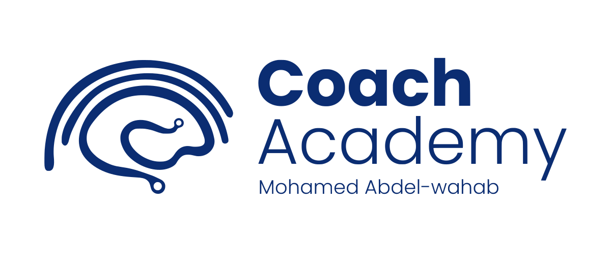

# Senior2026



## Coach Abdelwahab & Ashraf Senior 2026 Competitive Programming Library

Senior2026 is a public Competitive Programming learning portal for Senior 2026 training, prepared by Coach Abdelwahab and Ashraf under Coach Academy.

The website collects standalone HTML tutorials into one searchable, navigable GitHub Pages library while preserving the original tutorial files exactly as imported.

## Website

The public site is designed to run on GitHub Pages:

```text
https://cewatlac.github.io/Senior2026/
```

## Library Contents

- Graphs
- Paradigms
- Data Structures
- Geometry
- Video catalog with available recordings and reserved future slots
- Topic browser with search, categories, and sequence navigation

## Repository Layout

```text
index.html              Main landing page
topics.html             Searchable topic browser
videos.html             Video catalog
about.html              Program and contact information
roadmap.html            Public expansion roadmap
404.html                GitHub Pages not-found page
assets/                 Portal CSS, JavaScript, and metadata
learn/                  Navigation wrapper pages for tutorials
tutorials/              Original imported tutorial HTML files
tools/                  Validation and generation utilities
RIGHTS.md               All Rights Reserved notice
```

## Local Preview

The site is fully static. To preview it locally:

```bash
python3 -m http.server 8000
```

Then open:

```text
http://localhost:8000/
```

## GitHub Pages

The repository is ready for GitHub Pages through the included GitHub Actions workflow.

For a free GitHub account, the repository must be public before GitHub Pages can deploy. If the repository is private, GitHub will show:

```text
Upgrade or make this repository public to enable Pages.
```

Enable deployment with these repository settings:

1. Settings → General → Danger Zone → Change repository visibility → Make public
2. Settings → Pages → Build and deployment → Source → GitHub Actions
3. Re-run the `Deploy GitHub Pages` workflow from the Actions tab

All internal paths are relative so the site works correctly under the `/Senior2026/` project path.

## Content Integrity

The tutorial files under `tutorials/` are preserved as standalone HTML lessons. The portal adds navigation, search, metadata, and wrapper pages around them without rewriting the educational content.

Validation output is stored in:

```text
tools/validation-report.json
```

## Contact

- coach@coach-academy.net
- a.ashraf@coach-academy.net

LinkedIn:

- Ashraf / Coach Academy: https://www.linkedin.com/in/cewatlac/
- Coach Abdelwahab: https://www.linkedin.com/in/mohamed-mahmoud-abd-el-wahab-mohamed-abd-el-moneim-mahmoud-6944152/

## Rights

© 2026 Coach Academy. All rights reserved.

The tutorial content and portal materials may not be copied, redistributed, modified, republished, or reused without prior written permission from Coach Academy. See `RIGHTS.md`.
